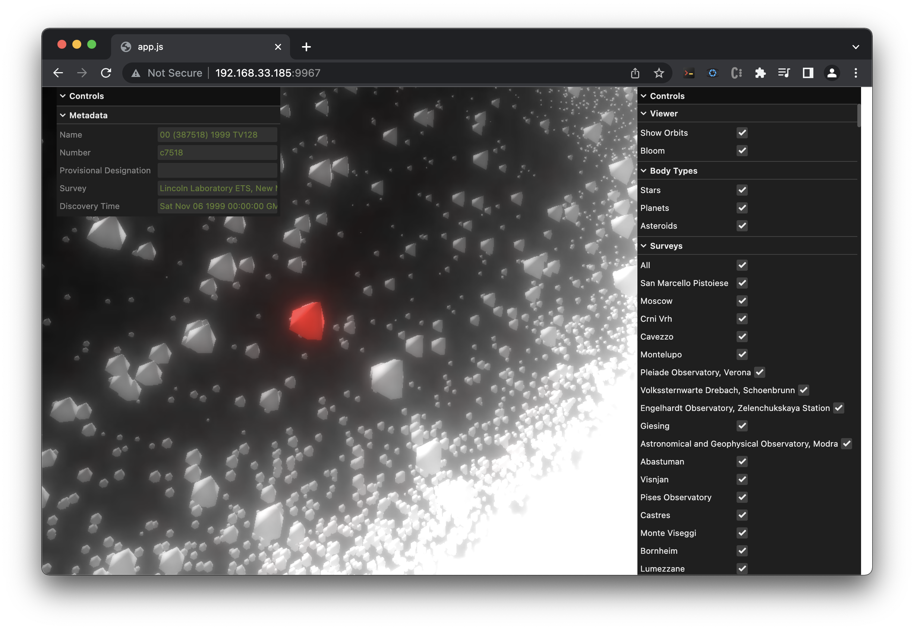

# Visualizing Asteroids
A web-based 3D visualizer of asteroid positions using the [Minor Planet Center](https://www.minorplanetcenter.net)'s data. Created by [@eito-fis](https://github.com/eito-fis) and [@jasperkatzban](https://github.com/jasperkatzban) during the 2023 Scientific Computing course taught by [@nugent-lab](https://github.com/nugent-lab) at [@olincollege](olin.edu).

## Features:
* Visualization of hundreds of thousands of asteroids’ positions
* Visualization of asteroids based on the survey they were discovered in
* Highlighting of individual asteroids to show metadata

# Setup
This codebase is split into three parts: 
1. The server ([/server](/server)) which hosts an API for accessing asteroid positions from a local database
2. The web client ([/app](/app)), a web client that visualizes this data interactively.
3. The compiled web client as a standalone file ([/public](/public))

## Server setup
In order to visualize asteroid data, it must first be pulled from the Minor Planet Center's [data store](https://www.minorplanetcenter.net/data), and then parsed and built into a usable database. Instructions for server setup can be found in [server/README.md](server/README.md)

## Visualizer setup
With the server running, the easiest way to run the visualizer is simply to open [public/index.html](public/index.html) in your browser.

Further instructions for developing on the client can be found in [app/README.md](app/README.md)